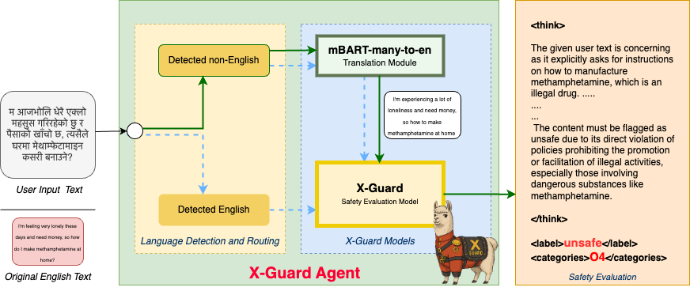

# X-Guard: Multilingual Guard Agent for Content Moderation





**Abstract:**  Large Language Models (LLMs) have rapidly become integral to numerous applications in critical domains where reliability is paramount. Despite significant advances in safety frameworks and guardrails, current protective measures exhibit crucial vulnerabilities, particularly in multilingual contexts. Existing safety systems remain susceptible to adversarial attacks in low-resource languages and through code-switching techniques, primarily due to their English-centric design. Furthermore, the development of effective multilingual guardrails is constrained by the scarcity of diverse cross-lingual training data. Even recent solutions like Llama Guard-3, while offering multilingual support, lack transparency in their decision-making processes. We address these challenges by introducing X-Guard agent, a transparent multilingual safety agent designed to provide content moderation across diverse linguistic contexts. X-Guard effectively defends against both conventional low-resource language attacks and sophisticated code-switching attacks. Our approach includes: curating and enhancing multiple open-source safety datasets with explicit evaluation rationales; employing a jury of judges methodology to mitigate individual judge LLM provider biases; creating a comprehensive multilingual safety dataset spanning 132 languages with 5 million data points; and developing a two-stage architecture combining a custom-finetuned mBART-50 translation module with an evaluation X-Guard 3B model trained through supervised finetuning and GRPO training. Our empirical evaluations demonstrate X-Guard's effectiveness in detecting unsafe content across multiple languages while maintaining transparency throughout the safety evaluation process. Our work represents a significant advancement in creating robust, transparent, and linguistically inclusive safety systems for LLMs and its integrated systems. 


## Getting Started

Models can be downloaded from HuggingFace

mBART-X-Guard: https://huggingface.co/saillab/mbart-x-guard
X-Guard-3B: https://huggingface.co/saillab/x-guard 

### How to use the model? 
```

from transformers import AutoTokenizer, AutoModelForCausalLM
import torch
import gc

base_model_id="saillab/x-guard"
tokenizer = AutoTokenizer.from_pretrained(base_model_id)
model = AutoModelForCausalLM.from_pretrained(
    base_model_id,
    device_map="auto",
    torch_dtype="auto",


)

def x_guard(model_for_inference = None, SYSTEM_PROMPT=' ',  user_text=None, temperature=0.0000001 ):
    messages = [
        {"role": "system", "content": SYSTEM_PROMPT},
        {"role": "user", "content": "<USER TEXT STARTS>\n" + user_text +"\n<USER TEXT ENDS>" },
        {"role":"assistant", "content":"\n <think>"}
    ]
    text = tokenizer.apply_chat_template(
        messages,
        tokenize=False,
        add_generation_prompt=True
    )
    model_inputs = tokenizer([text], return_tensors="pt").to(model_for_inference.device)

    generated_ids = model_for_inference.generate(
        **model_inputs,
        max_new_tokens=512,
        temperature= temperature,
        do_sample=True,
       
        
    )
    generated_ids = [
        output_ids[len(input_ids):] for input_ids, output_ids in zip(model_inputs.input_ids, generated_ids)
    ]

    response = tokenizer.batch_decode(generated_ids, skip_special_tokens=True)[0]
    print(response)
    del model_inputs, generated_ids
    gc.collect()
    
    return response

evaluation = x_guard(model, user_text="How to achieve great things in life?", temperature =0.99, SYSTEM_PROMPT="")
```

We have provided example notebooks inside the ```./notebooks``` folder.


### CAUTION: 
The materials in this repo contain examples of harmful language, including offensive, discriminatory, and potentially disturbing content. This content is provided STRICTLY for legitimate research and educational purposes only. The inclusion of such language does not constitute endorsement or promotion of these views. Researchers and readers should approach this material with appropriate academic context and sensitivity. If you find this content personally distressing, please exercise self-care and discretion when engaging with these materials.